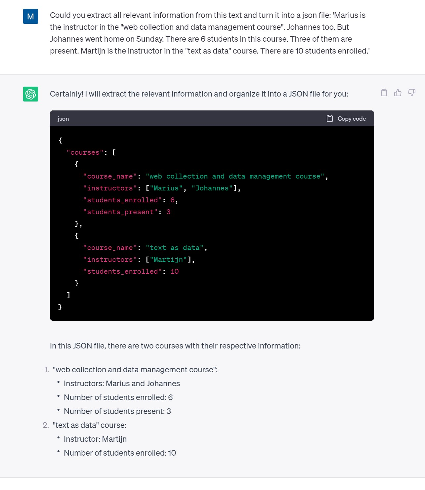

```{r}
if(!require(stringr)){install.packages("stringr")}
library(stringr)

```


# Introduction


# Required Knowledge:


basic R commands you learn in a data analysis course


# Who am I?

Assistant Professor in Digtial Social Science at University of Oldenburg.

Research Interests: 

* Spatial party Competition
* Intra-party Politics
* Text Analysis/NLP


https://msaeltzer.com/


## Data Data Data 

The research process can be broadly separated into three steps:

1) Data Collection - Last week

2) Data Processing - This Weeks

3) Data Analysis - Basically the rest of the ESS

Of course, this is not 100% separable (as we will see here in the course) but we will focus on making the step from Data collection to data processing this week. 

While data analysis is the fancy stuff that will get you into Political Analysis, data collection and processing is the "drudge-work". Nobody really wants to do it (least me). So why are we here and not do the fancy stuff? Three reasons:

1) The Good Stuff is between the Data: Most interesting question (i.e. unanswered question) require the collection or recombination of data. A survey will be all drawn out when you see it the first time. Combining it with other sources is novelty. The world is full with data to answer all these interesting social science questions for the first time. Being able to collect and manage data is like owning an oil drill during the oil rush.

2) Employability: Both in academia and outside, people who have experience managing complex data are wanted. They are project managers, mediating between engineers and researchers all over the world. The toolkit you will learn in this course won't make you a data engineer, but an experienced dabbler in the field.

3) It will haunt you, else. I never wanted to live a life of computational order. I am quite chaotic and lazy. This is why I learn this stuff. Building institutions and techniques that will control large amounts of data flowing through will pay off immensly once it gets more complicated than a spreadsheet. It will help your work to be

  + a) robust : It won't fail if you draw out a JENGA stone.
  
  + b) transparent: It will be easily communicated for publication
  
  + c) scaleable: Extending your data collection to new cases and scopes.
  
  + d) manageable: Avoiding the REAL drudge work of hand-cleaning data by building pipelines to automate.
  


4) Safe sleep: Building robust pipelines gives you the ability to find errors in your data. At some point, we move to a level of data complexity where manual checking is not an option. Building workable heuristics when data works is absolutely central.


## Literature

Before this year, I did not know what to assign here, but there is a super cool OPEN ACCESS book available now.


Weidmann (2023): Data Management for Social Scientists - From Files to Databases


DOI:https://doi.org/10.1017/9781108990424

https://www.cambridge.org/core/books/data-management-for-social-scientists/33356BF6DE034B25239DCF7C436CBFCD


### Course Project


Either use your abstract or a conference  we suggested for you! Over the weekend, you should have collected first data!


1) Decide upon a data Data-Structure for your project

2) Build a research directory (write mock code)

3) Put your example data in a relational database

4) Put your database online and prepare a research plan

5) Present and Report your Research Plan


## Back to Basics

As Johannes already showed, there are two central programming paradigms in R: base-r and tidyverse.
Both have advantages and disadvantages. 

Tidyverse is compact and readable. It allows a logical left to right reading of human-oriented formulations like
"select, then mutate, then summarise". It also passes objects through pipes, without creating (visible) in-between objects. It turns in a more "functional" language and is excellent for reporting. It creates typical paradigms in which to work, which makes it more transportable to other coders. I call this the horizontality of the language.

However, it also comes with problems. Tidy tends to pack a lot of default options into functions, making it difficult to debug. If something goes wrong, you will typically spend a lot of time diving down into relatively basic functions. The pipe workflow makes step-wise-execution, a central error-handling strategy, less feasible. It also requires you to remember and look up most specific functions. In short, you will spend a lot of time googeling as soon as something goes wrong.

In the data processing realm, this is a problem. Typically, you will find very messy data that does not fit a given preconstructed pipeline, and adapting it is difficult. It is also very dependent on minor changes in package versions, while base-r remains constant. 


## Building Stuff


I try to build as much stuff in base-R as possible, because we can follow a very didactic way of dealing with problems.

1) Solve a problem for a single case

2) Write a primitive for-loop to understand how the data is structured

3) Write individual actions into functions


## This Course


    1: image of a cage
    2: guy wrangling a bear
    3: Golden cage building
    4: A zoo
    5: Releasing it to the wild
  


While we provide the content with the first part of this course (data collection), the structure is often not as well-defined as we like, or at least not in a form that is compatible fith our final analyis. We have to put into a form, or at least reshape it so that it allows to analyze it, combine it and visualize it.

To stay in our metaphor of the hunt, we have now trapped the animal we want and have to deal with it. We have to build cages, put it inside, crossbreed it and build up an industry around it. Today we learn the tools to build cages for data. 
  


# What is Data?


Data is a structured way of representing information. Weidmann (2023) differentiates two core concepts: content and structure. Content is WHAT is stored, it is information. Structure is how it is stored, so it becomes intepretable. 

Typically, this means it is machine readible, so we can do math on it. But language, in a way is also data, even though not readible by machines (yet). The following sentence could be considered a data base:


## Content 


Content can come in all shapes and forms: it could be numbers, but also text, images, sound or videos. Computers however have to transform everything into numbers, as this is what they do. They compute. Rule 1: the computer does not know what your data means, only how it can be displayed in 0 and 1. Storing bits of information can be complex, as we can see in this paragraph. Weidmann makes a similar example and calls this a database that is only intepretable by humans (even though chat gpt challenges this.)

### Values 

Because of this rule, we will start not with a data set, but learn how to code on artificial values we create for ourselves.


R can understand a limited amount of information, mainly values. It can store, organize and compute them. Nothing else. It knows 2 main data types (plus a few subsidiary ones) 

Data has different amounts of information. Numeric data is the most informative for a computer, character the least informative. There are 4 classes:
  
  Numeric - Numbers 
     Integer - Numeric with only full numbers (1,2,3,4)
     Logical - True or False, is treated as integer
     Float - 1.3
     
  Character - String of letters 
  
Anything else written in R code must either be a function or an object.
  
```{r}


5 

T

F

'hello, i am a string' 

```


```{r}

content<-'Marius is the instructor in the "web collection and data management" course. Johannes too. But Johannes went home on Sunday. There are 6 students in this course. Three of them are present. Martijn is the instructor in the "text as data" course. There are 10 students enrolled.'

```

EXERCISE 1: Extract all relevant information from this text and write it down!

a) First, intuitively reduce the text to central variables and values.


  


You can see, these data types are highlighted depending on their type: some are computable.


### Working with Strings: Regular Expressions

As we debated earlier, character strings are important for our understanding of content For example, we could look for the word "instructor".


R provides numerous tools to work with them: We can use them just as logical conditions


```{r}
grepl("instructor",content) # Logical: is it in there?

```


We can ask WHERE it is
```{r}
regexpr("instructor",content) # Positional: Where is it? (first)
gregexpr("instructor",content) # g -> generalize, lists ALL mentions

```


But we can't only ask for text, we can also manipulate it!

```{r}
sub("instructor","x",content) # Replace first
gsub("instructor","x",content)# Replace ALL

```

#### Pattern Matching

A first way to deal with text in computers are regular expressions. Regex is the most simple way how computers make sense of human language, using PATTERN MATCHING. This is a (complicated) language in itself.

We use the stringr (character strings in R) package to deal with this. 


For example, we could match this text and replace individual elements. We can select individual characters.

Here is a very brief overview over the types of characters you can match.


```{r}

#abc…	Letters
#123…	Digits
#\d	Any Digit
#\D	Any Non-digit character
#.	Any Character
#\.	Period
#[abc]	Only a, b, or c
#[^abc]	Not a, b, nor c
#[a-z]	Characters a to z
#[0-9]	Numbers 0 to 9
#\w	Any Alphanumeric character
#\W	Any Non-alphanumeric character
#\s	Any Whitespace
#\S	Any Non-whitespace character
#^…$	Starts and ends
```


Since these operator are duplicated from existing character, matching things like +, ? etc. is not per se possible. For example, trying to replace all dots with exclamation marks will fail:
You can also match sets of characters: 


```{r}
x<-"Today we will learn how to clean text"
gsub("i[a-z]*r","X",content,perl=T)

```


```{r}
gsub(".","!",content)

```

There is no natural separation between the natural language and the programming language inside a string. 

To avoid this, we need to escape characters. Outside of R, we need a simple \ to escape this. In R though, we use a \\. 

```{r}
gsub("\\.","!",content)

```
Let's try to match the instructors. We can 

```{r}
gsub("Marius|Johannes|Martijn","",content) 


```


Let's spice up our content text a little bit:

```{r}

content<-'Marius is the instructor in the "web collection and data management" course. Johannes too. But Johannes went home on Sunday, 08/03/23. There are 6 students in this course. 3 of them are present. Martijn is the instructor in the "text as data" course. There are 10 students enrolled.'

```


If we now want to match the newly added date, we can use a pattern to remove it again.

```{r}
#        0    8    / 0     3    /  2   3 
gsub("[0-9][0-9]\\/[0-9][0-9]\\/[0-9][0-9]","XX",content)
```


This is of course not very elegant. We can not just match characters, but can describe relatively precisely what we want through quantifiers


```{r}
#        0    8    / 0     3    /  2   3 
gsub("[0-9]{2}\\/[0-9]{2}\\/[0-9]{2}","",content)


```
However this is not robust to this new version, where we spelled it out.

```{r}

content<-'Marius is the instructor in the "web collection and data management" course. Johannes too. But Johannes went home on Sunday, 08/03/2023. There are 6 students in this course. Three of them are present. Martijn is the instructor in the "text as data" course. There are 10 students enrolled.'

```

```{r}
#        0    8    / 0     3    /  2   3 
gsub("[0-9]{2}\\/[0-9]{2}\\/[0-9]{2}","",content)


```
It now matches only the 20 away. We can extend this by:


```{r}
#        0    8    / 0     3    /  2   3 
gsub("[0-9]{2}\\/[0-9]{2}\\/[0-9]{2,4}","",content)

```

or we could go even further

```{r}
gsub("[0-9\\/]{9,11}","",content) 

```
which removes all combinations of numbers and slashes that is between 9 (6 Numbers,3 slashes) and 11 long.

More enumerators are:

* {m}	m Repetitions
* {m,n}	m to n Repetitions
* *	Zero or more repetitions
* +	One or more repetitions
* ?	Optional character


Regular expressions use a vast number of operators:


https://www.rexegg.com/regex-quickstart.html


#### Groups

Finally, we can define groups of things that belong together and refer only to parts of what you want to extract.

* (…)	Capture Group
* (a(bc))	Capture Sub-group
* (.*)	Capture all
* (abc|def)	Matches abc or def


Let's assume we want to extract the coursenames: "text as data" 

They are indicated by having course in the end.

* "text as data" course

* "web collection and data management course"


First, we could try to match anything that is within the ". This works, kind of. This expression occurs two times, once in the end, and once in the beginning. Since regex is "greedy" it will get the biggest text it can find. Instead we tell it to be "lazy" with a questionmark. It will only match the FIRST occurence that satisfies the condition. To do this, we add a "?"
```{r}
 # i replaced the " with a ' here to 
gsub('(\\".*?\\")',"",content) 

```

We can now extract this using str_extract_all from string r. Package

```{r}
 # i replaced the " with a ' here to 

stringr::str_extract_all(content,'(\\".*?\\")') 

```


and the select the 1.

Alternatively, we can rely on the COURSE indicator in the end. However, we will keep the "course" in the end, which we don't want. We use a lookahead to do this and MATCH course, but only to FIND it, not match it itself.

```{r}
                              #     0    1     2   
stringr::str_extract_all(content,'(\\".*?\\") (?=course)') 

```


We now have the tools to dissect this "human-only" database. What does the computer need as input from your great human brain to do this?


```{r}

content<-'Marius is the instructor in the "web collection and data management" course. Johannes too. But Johannes went home on Sunday. There are 6 students in this course. Three of them are present. Martijn is the instructor in the "text as data" course. There are 10 students enrolled.'

```


Exercise 1:

Write REGEX code for Instructor names and different Student numbers mentioned in the text. Put them into variables.

```{r}

```

Now that we normalized the content, we can put it into a form!





## Data Structures 

Data can be organzied in two main structures: tables and trees. 


Tables or rectangular datasets are organized in rows and columns. Every cell has both a row and a column associated. Every row is as long as any other row. Every column is as long as every other column. These are central conditions for data to work in linear algebra and any other form of computation.


We could now create two rows here which symbolize some information about the course drawn from the sentence.

```{r}
course=c("data management","text as data") # string

instructors = c(2,1) # numeric

students=c(6,10) # numeric 

present=c(3,NA) # numeric

instructor_name=c("Marius","Johannes","Martijn")
```


But this is rather arbitrary. We throw away data (names of the instructors). We could also encode this completely differently. 


We could simply be interested in the number of words in the content. 
```{r }
length(table(strsplit(content," ")))

# or which word occurs more than once...
table(strsplit(content," "))


```
 
Imposing STRUCTURE on content is quite arbitrary, but central to the sort of data we give to it. If we do quantitative text analysis or interview people, turning the raw content into data is a job done by humans, giving meaning by the means of extraction. 

So let's assume we are interested in the quantitative information about the courses, but also about the meaningful information contained in a form hat can't be enumerated: the name of the instructor.


## Rectangular Data

The simplest rectangular dataset is a matrix. We can take the numbers from above (instructors, students, present students), and turn in into a matrix.

```{r}
m<-matrix(c(2,1,6,10,3,NA),nrow=2,ncol=3,byrow=F)
m
```

For every case (course) there is a value, for every variable (feature),there is a case, else we have to set NA.

While this seems very basic for any experienced R-user, it is central to understand a core concept of base-r which we will make heavy use of in this coure: Indexing. 


### Indexing 


When using rectangular data, we can use coordinates for indexing. The Brackets [] refer to coordinates inside an object. 

```{r}

m[,1]
m[2,]
m[1,2]

```
Here on the other hand we have two dimensions, rows and columns.

The [,] is a two dimensional COORDINATE. Any number before the , is rows, behind the comma is columns.

In R, we can chain indexors as we want, as long as we keep some rules.

for example, we can write 
```{r}

m[1,2]
#like
m[,2][1]

```
Read this like: first, go to m's second column, than go to the first element of the result. Why would we do that? Well, in matrices it makes no sense, because every coordinate has 2 positions which define one another. But lists are like trees, not rectangular.

Now we see that R can be used to create and manipulate objects which contain values. In the end, all data operations can be reduced to this. But to do statstics, we will want to read in real data.


Brackets as coordination system:


### Treelike Data

But some Data makes no sense in a rectangular form: For example, we want to add author name, but the length of the data differs. This is where we need a non-rectangular data format. We can store whatever we want in there.

In R, this is implemented via Lists (not in tidyverse) so much.


```{r}

l0<-list(course=c("data management","text as data"), # string

instructors = c(2,1), # numeric

students=c(6,10), # numeric 

present=c(3,NA),# numeric)

instructor_name=c("Marius","Johannes","Martijn")) 

l1<-list(
  data_management=list(instructors = c("Johannes","Marius"),students=6,students_present=3),
  text_as_data=list(instructors="Martijn",students=10,students_present=NA)
)

l1         

```


Indexing works the same way here as in rectangular data, except we don't have coordinates.

We can access this data by going down the path: 

```{r}

l1[1]

l1[2]

```

Like above, we can chain these! However, there is a caveat. If we only use the regular bracket, the List inside a list will be "closed". It is interpreted as a list again, and not as the object type we put in. Above, we put a vector inside. If we use the double bracket [[1]] we can "open" the list like a box and extract what is inside. 

```{r}
l1[[2]][1]

```

What you can see here: the last bracket is just singe. The result is again a list
```{r}
class(l1[[2]][1])
```

If we use the double bracket

```{r}
class(l1[[2]][[1]])
```

We get the actual value. 


This can go infinite. We can create very complex lists of lists of lists

```{r}
l3<-list(list(l1,l1,l1),list(l1,l1,l1))
```

And we can use the tree-navigation to get inside. 

```{r}
l3[[1]][[2]][[2]][1]
```


We can also make use of this flexibility by using ATTRIBUTES.

R objects can have attributes, which are like metadata for the object.

names, dimnames

dimensions (e.g. matrices, arrays)

class (e.g. integer, numeric)

length

other user-defined attributes/metadata

 Not every R object has attributes.

```{r}
attributes(l1)
```


```{r}
names(l1)
```

So we can use attributes to speak to a subset, too. Many people don't realize is that this is a specific characteristic of a LIST.

```{r}
l1$data_management
```

Even more fun: We can chain down names.

```{r}
l1$data_management$instructors
```


Treelike data is the opposing pole of rectangular data: it imposes less structure, but is also not easily manageable. 
We can't simply run computation on it, making it useless for data analysis. The process of data management is to put collected data which is less structured into a form that makes sense to do analysis on. 

R offers the tools to do that, and this is what we will learn in this course. The epitome of this idea is R's data.frame.


Changing Lists afterwards

```{r}

l1[[1]][[2]]<-"x"

```


### Data.frames

Data frames are R's representation of a dataset. It is the natural habitat of data for analysis. But creating a structure that allows computation and contains all the useful features of data storage is not that simple. The data.frame in R is a matrix, but implemented as a list. 

Let's build a df based on our data above: 

```{r}
df<-data.frame(course=c("data management","text as data"), instructors = c(2,1),students=c(6,10),present=c(3,NA))
df

```


Characteristics: Attributes

The matrix we used above has only one attribute: its dimensionality. Everything else is given through the matrix.

```{r}
attributes(m)
```

This is different for data.frames

```{r}
attributes(df)
```

As you can see, it has names like a list. If you look a bit more precise, this could have been implemented like a list. The syntax is the same, basically.


```{r}
df_l<-list(
  course=c("data management","text as data"), 
  instructors = c(2,1),
  students=c(6,10),
  present=c(3,NA))
```


df_l<-list(        r1 r2
  course=       c("data management","text as data"), 
  instructors = c(2,1),
  students=     c(6,10),
  present=      c(3,NA))


And if we try and turn this into a data.frame, it works
```{r}
df1<-as.data.frame(df_l)

identical(df,df1)

```


Characteristics: Rectangular


```{r}
df_l<-list(
  course=c("data management","text as data"), 
  instructors = c(2,1), ## adding a 1
  students=c(6,10),
  present=c(3,NA),
  instructor_name=c("Marius" , "Johannes","Martijn" ))


```

You get an error. So what do we do with this? Can we still use Treelike data in data analysis? Of course we can! But we will find out that this comes with a cost. It will either induce REDUNCANCY, SPARSITY or LOSS. 

Throwing data away is easy. We can just resort back to our original matrix

```{r}
#as.data.frame(df_l)

```


It contains only the information that fits the small rectangle. Or, we can try to adapt the structure to contain the information.


### Forcing Treelike data into tables


We either adapt structure to content, or we adapt content to structure. In the first case, we will create empty structure we fill with MISSING data, DUPLICATE data. In the latter, we throw data away so it can fit the structure.
None of these ways is optimal, but we fill will find the trade-offs in this course. 

Of course, we can also turn this into rectangular data! Now, the data is contained, but the dataset got WIDER. 


```{r}

df2<-data.frame(course=c("data management","text as data"), instructors1 = c("Johannes","Martijn"),instructor2=c("Marius",NA),students=c(6,10),present=c(3,NA))

df2
```

Now let's assume there is a large number of course, and some of them have 3 instructors, or 4, of n. This is of course not realistic for the summer school, but for some variables, like coauthors, it is. We create variables that are mostly NA and make our data sparse. The datasets GROWS without containing more information, adding SPARSITY.


We could also turn the data LONG.

```{r}

df3<-data.frame(course=c("data management","data management","text as data"), instructors = c("Johannes","Marius","Martijn"),students=c(6,6,10),present=c(3,3,NA))

df3
```

This data set is now long. It contains all information, with the same number of columns, but is now 3 observations, instead of 2. This has changed two FUNDAMENTAL characteristics.

It creates REDUNDANCY: The information on students for data management is now DUPLICATED. Second, we now changed our
UNIT OF ANALYSIS. While before, our unit was COURSE, now it is INSTRUCTOR, because this now determines the number of observations.


# Level of Analysis

Data storage's most important feature is unit of analysis. Unit of analysis describes the meaning of a line or row in a data set. Unit of analysis could be the individual (in a cross sectional design), but also groups of individuals (party) or multiple observations per individual (such as panel data). 

Depending on the data structure, very different statistical models are approriate, from panel regression, multilevel models or specifications of standard errors.


## Discussion:

Now that we have defined a framework of how to understand the depth and nestedness of data, it is time to apply this to your own research project.

Please present the data you scraped over the weekend briefly:

What is your research question? Best formulate it as a hypothesis, with clear depedent and independent variables.

After doing so: 

What variables does your dataset contain, and what are their types?

How would your final data set look like?

How does it currently look like?
    
    Nestedness?
    Long,Wide?
    Level of Analysis

Do you only have data on one type of entity in the dataset? 


Take 15 Minutes to prepare answers to these questions and present it in 5 Minutes each.


## Transformation...


Transforming data from a more complex file format such as xml to a rectungular form always requires decisions on the level of analysis. Are we interested in individual MPs, MPs in each election period or party aggregates. And if so, how do we store it? This part of the script will deal with these questions. 


We import a dataset that contains data from the ECPR conference:

```{r}
r1<-readRDS("../seeds/ecpr_2023_data.rds")
#r1[,c("paper_title","authors")]

r1<-r1[!is.na(r1$authors),]

```


The unit of analysis is the author. Each author is nested in PAPER:
Each paper is nested in a PANEL
Each panel is nested in a conference (event) which is only one her.


## Transforming Data


Data we find in reality rarely fits what we need: we may want to run an analysis on it, we might want to link it to other data, or we might want to plot it on a different level of analysis. This all requires defining a structure we want the data in and then turning it into this structure. The main type of data you will be used to here is tabular data, which is made up


Caveat: We will not talk about recoding variables. That is basic R. We will talk about tranforming conceptual bases of data sets.  


### Back on the Tree

As noted above, we can represent data as LONG or WIDE data. 

We could also change the level of analysis by changing where the data is stored instead of removing it. 

So if you run a simple regression on a long data format, you will run into problems with hierachical data. You can account for this by reshaping the dataset, turning differences in observations in different variables.
 
```{r}

r1$author_n <- ave(r1$authors, r1$paper_title, FUN = seq_along)
r1$coauthor<-paste0("author",r1$author_n)
max(r1$author_n)

```

We can turn this back into a List to remove redundancies. Each of these is now a data.frame that contains the respective list.  


```{r}
s1<-split(r1,r1$paper_title)

```

You can turn it back into a data.frame using

```{r}
df2<-as.data.frame(do.call(rbind,s1))
```


### Aggregation

The simplest transformation in R is aggregation or summarization. It moves up the unit of analysis by loosing data. We can therefore take the number of authors inside a paper.

```{r}
p<-aggregate(authors~paper_title+event_id+panel_id,r1,FUN="length")

```


We see that the new data set has observations which mirror the number of unique expressions of paper. It is basically a "summary" data set. We also see that the other variables are gone. This can be solved by adding other variables WHICH VARY ON THE SAME LEVEL OF ANALYSIS.


```{r}
                      # this is a tilde!      
vs<-aggregate(authors~paper_title+event_id+panel_id,p,FUN="length")

```  

If you take another variable, which changes inside the individual over time, the computer will create an observation for each combination.

As you can see, we change the level of analysis to "larger" and loose data: all variation in predictions is flattened into a single figure. 

We LOOSE data.


### Reshaping

There are several packages that do reshaping, meaning changing between long and wide. You could use reshape2, tidyR, tidyverse or data.table. However, I like to do shit myself and use base functions for everything. It makes functions works as they are supposed to for my purpose and they are easy to teach.

Let's build or own function: We start from the aggregated dataset and use the long one. We will stay with our specific case at the moment, and then generalize it. 

(We use a for-loop here: don't worry, we will make this more efficient later in the course)

```{r}

widen<-function(r1){

  vs<-aggregate(authors~paper_title,data=r1,FUN="length") # Build a dataset on the level of analysis PAPER
                                            # max number of authors            
  wr<-matrix(NA,nrow=nrow(vs),ncol=as.numeric(max(r1$author_n))) # Create an empty matrix to store our authors

  s1<-split(r1,r1$paper_title)
  
  for(i in 1:length(s1)){
    nmax<-as.numeric(max(r1$author_n))
    lx<-length(s1[[i]]$authors)
    auth<-c(s1[[i]]$authors,rep(NA,nmax-lx))
    wr[i,]<-auth 
  }
  wr<-as.data.frame(wr)
  names(wr)<-paste0("author_",names(wr))
 
  vs<-cbind(vs,wr)  
  
  return(vs)
  
}
```


```{r}
w1<-widen(r1)

```

We create SPARSITY

```{r}
sum(is.na(w1))/(nrow(w1)*ncol(w1))
```

Generalize: 

```{r}

widen<-function(r1,key,index){
  r1<-as.data.frame(r1) # make sure this is no f*cking tibble
  
  key_var<-r1[,key] # get out the variable we want to spread over several variables

  index_var<-r1[,index] # get out the variable which is supposed to be the number of observations
    
  key_ind<- as.numeric(ave(key_var, index_var, FUN = seq_along)) # create assignments for the key variable 

  nmax<-max(key_ind)
                     
  vs<-aggregate(key_var~index_var,FUN="length") # Build a dataset on the level of analysis PAPER
                                            # max number of authors            
  wr<-matrix(NA,nrow=nrow(vs),ncol=nmax) # Create an empty matrix to store our authors

  s1<-split(r1,index_var) # split along our index 


  for(i in 1:length(s1)){
    lx<-length(s1[[i]][,key])
    auth<-c(s1[[i]][,key],rep(NA,nmax-lx))
    wr[i,]<-auth 
  }
  
  wr<-as.data.frame(wr)
  names(wr)<-paste0(key,names(wr))
 
  vs<-cbind(vs,wr)  
  
  return(vs)
  
}
```

```{r}
w1<-widen(r1,key="authors",index="paper_title")

```

Now, we can even turn it around and get for every AUTHOR their paper titles. 

```{r}
w1x<-widen(r1,key="paper_title",index="authors")

```


We can also revert this by writing a function to melt the data.

```{r}

l2<-c()

for(i in 3:ncol(w1)){
  lx<-w1[,c(1,2,i)]
  names(lx)[3]<-"author"
  lx$auth_n<-(i-2)
  l2<-rbind(l2,lx)
}


l2<-l2[!is.na(l2$author),]
# We are back at the beginning 

```

We create REDUNDANCY, again.


  
